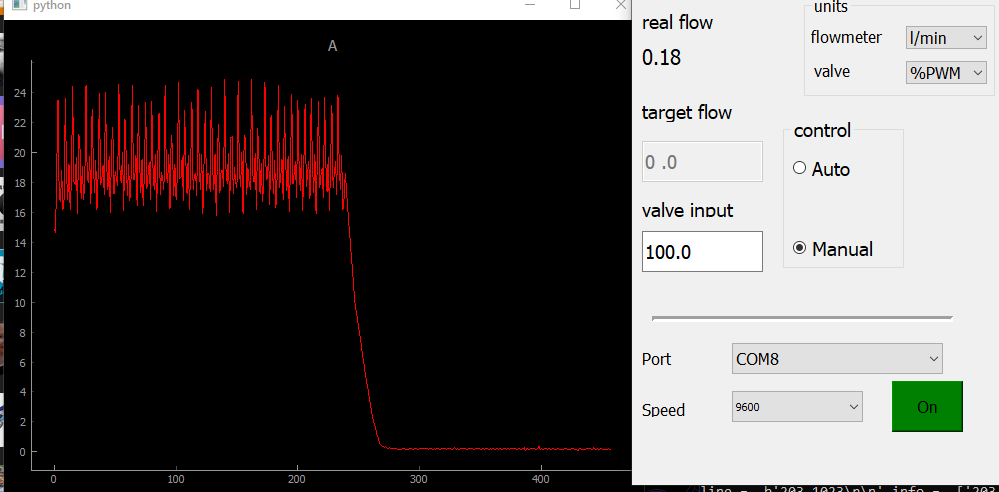
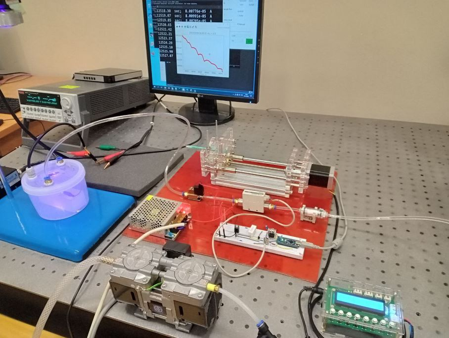
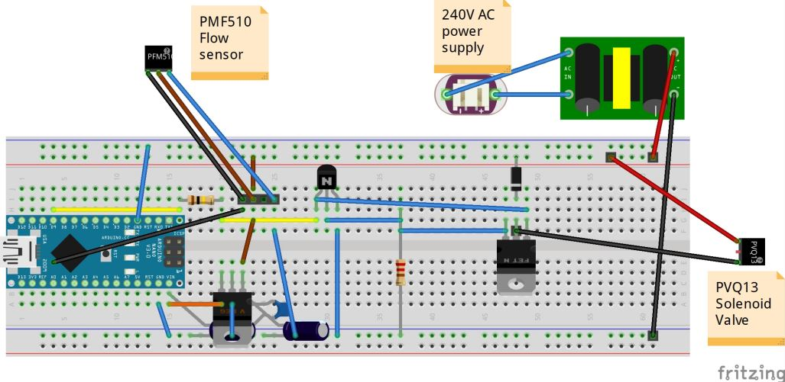

# MFC
Mass flow controller made from proportional valve, flow meter and arduino

Original topic: https://habr.com/ru/articles/487402/

Current fork is updating of some features.

=============================

This work was supported by the Ministry of Science and Higher Education of the Russian Federation, goszаdanie no.
2019-1080.

International Research and Education Centre for Physics of Nanostructures, ITMO University, Saint Petersburg 197101, Russia